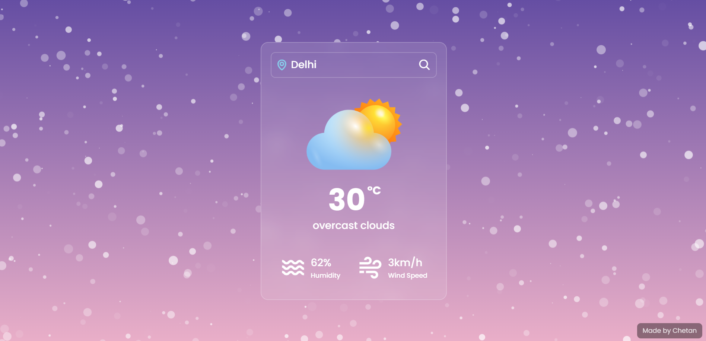
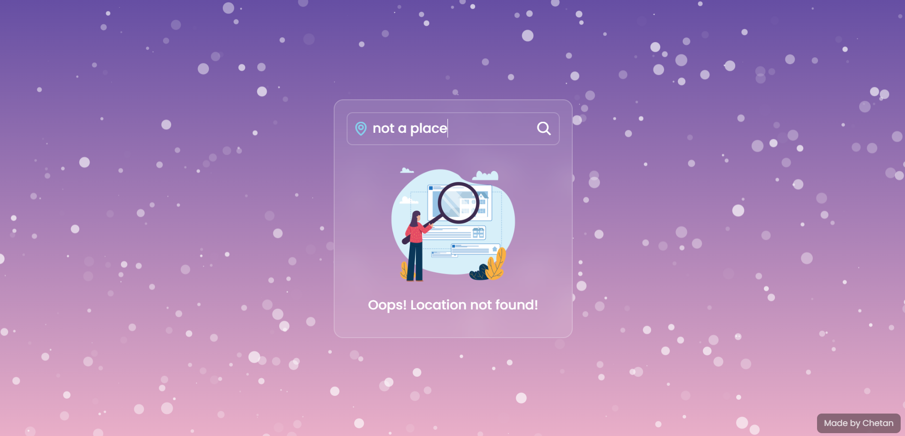

# 🌤️ DailySky – Your Minimalist Weather Companion
Get real-time weather updates in a clean, responsive interface.

## 🔗 Live Demo

[👉 Visit DailySky](https://daily-sky.netlify.app/)

## 📸 Screenshots

### Homepage View

## ✨ Features

- 🌍 Search current weather by **city name or ZIP code**
- 🌡️ Displays temperature, weather condition, humidity, and wind speed
- ❄️ Particle effects using `particles.js` (e.g., snow and grab)
- ⚠️ Graceful error handling for invalid location inputs
- 📱 Mobile-first responsive design
- ⚡ Fast and lightweight

## 🛠 Tech Stack

- **Frontend**: HTML5, CSS3, JavaScript
- **Weather API**: [OpenWeatherMap](https://openweathermap.org/api)
- **Particles & Visuals**: [`particles.js`](https://vincentgarreau.com/particles.js/)
- **Deployment**: [Netlify](https://www.netlify.com/)

## 📝 Notes
- 🌐 The app supports weather search by city name or ZIP code.
- 🌡️ Temperature is shown in Celsius
- 🧊 Particle effects are loaded dynamically, ensure your internet connection is active.
- 📵 The UI loads offline but requires internet for API and particle JSON.

## 📚 Resources

Here are the tools and resources used in this project:

- 🔗 [OpenWeatherMap API](https://openweathermap.org/api) – Provides real-time weather data.
- 🔗 [particles.js](https://vincentgarreau.com/particles.js/) – Adds visual snow & interactive grab effects.
- 🔗 [Netlify](https://www.netlify.com/) – Used for free hosting and live deployment.
- 🔗 [Font Awesome](https://fontawesome.com/) – Used for weather-related icons.
- 🔗 [Unsplash](https://unsplash.com/) – (Optional) for high-quality background images.
